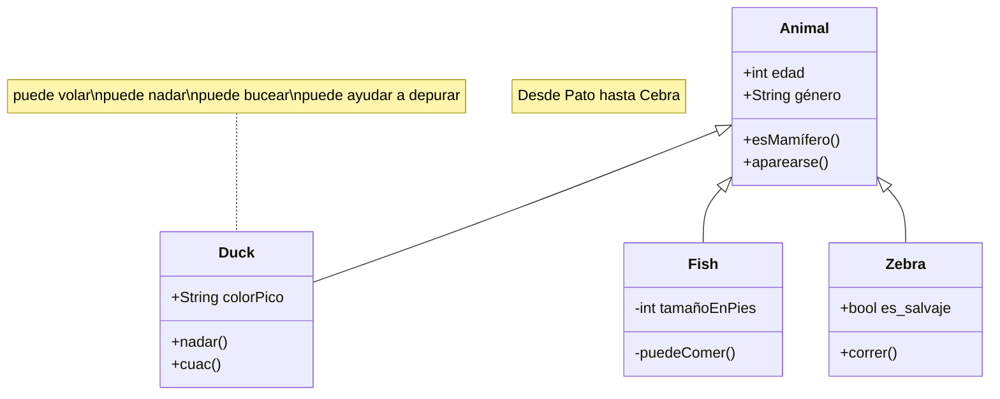

### Soporte para Remixicon

```text
:i{class="ri-poker-hearts-fill"}
:i{class="ri-poker-clubs-fill"}
```

:i{class="ri-poker-hearts-fill"}
:i{class="ri-poker-clubs-fill"}

### Soporte para Botón

```text
:btn[Google]{href="https://www.google.com"}
```

:btn[Google]{href="https://www.google.com"}

```text
:::btn{href="#"}
:i{class="ri-share-box-line"} Abrir en nueva pestaña
:::
```

:::btn{href="#"}
:i{class="ri-share-box-line"} Abrir en nueva pestaña
:::

### Soporte para Tarjeta de Github

```text
::github{repo="cirry/astro-yi"}
```

::github{repo="cirry/astro-yi"}

### Soporte para colapsar

```bash
:::collapse
¡Hola Mundo!
:::
```

:::collapse
¡Hola Mundo!
:::

### Soporte para admoniciones

```markdown
:::tip[Título Personalizado]
hola mundo
:::

:::note
nota
:::

:::caution
precaución
:::

:::danger
peligro
:::
```

:::tip[Título Personalizado]
hola mundo
:::

:::note
nota

```js
console.log("hola mundo");
```

:::

:::caution
precaución
:::

:::danger
peligro
:::

### Soporte para mermaid

Uso:

- comienza con **```mermaid**
- termina con **```**
- configura el frontmatter del markdown `mermaid: true`.

Código Mermaid:

```html title="mermaid.md"
classDiagram note "Desde Pato hasta Cebra" Animal <|-- Duck note para Duck
"puede volar\npuede nadar\npuede bucear\npuede ayudar a depurar" Animal <|--
Fish Animal <|-- Zebra Animal : +int edad Animal : +String género Animal:
+esMamífero() Animal: +aparearse() class Duck{ +String colorPico +nadar()
+cuac() } class Fish{ -int tamañoEnPies -puedeComer() } class Zebra{ +bool
es_salvaje +correr() }
```

Resultado:



### Soporte para mathjax

- configura el frontmatter del markdown `mathjax: true`.

#### Modo Bloque

```yaml title="Mathjax.md"
---
mathjax: true
---
¡hola!
$$ \sum_{i=0}^N\int_{a}^{b}g(t,i)\text{d}t $$
¡hola!
```

¡hola!
$$ \sum*{i=0}^N\int*{a}^{b}g(t,i)\text{d}t $$
¡hola!

#### Modo Inline

```yaml title="Mathjax.md"
---
mathjax: true
---
¡hola! $ \sum_{i=0}^N\int_{a}^{b}g(t,i)\text{d}t $ ¡hola!
```

¡hola! $ \sum*{i=0}^N\int*{a}^{b}g(t,i)\text{d}t $ ¡hola!

### Integración con Expressive Code

Para más uso, por favor consulta el sitio oficial [expressive-code](https://expressive-code.com/).

```js title="line-markers.js" del={2} ins={3-4} {6}
function demo() {
  console.log("esta línea está marcada como eliminada");
  // Esta línea y la siguiente están marcadas como insertadas
  console.log("esta es la segunda línea insertada");

  return "esta línea usa el marcador neutral por defecto";
}
```

### Plegado de código soportado por defecto

```js
var myArr = [1, 2];
console.log(myArr);

var myObj = { a: 1, b: 2 };

for (let key of myArr) {
  console.log(key);
}

var it = myArr[Symbol.iterator]();
it.next(); // {value: 1, done: false}

// VM704:12 Uncaught TypeError: myObj is not iterable
for (let key of myObj) {
  console.log(key);
}
```
